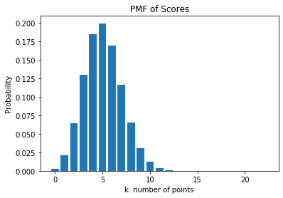

## Combinatorics, Probability & Discrete Distributions [Suggested time: 20 minutes]

### a. Set Theory

Given the following probabilities:

$P(A) = 0.7$

$P(B) = 0.5$

$P(B|A) = 0.4$

Calculate the following probabilities and assign to the variables `ans1` and `ans2`, respectively, in the next cell:

1.a.1) $P(A and B)$
1.a.2) $P(A|B)$

Hint: draw a diagram!


```
# import the necessary libraries
import numpy as np
import pandas as pd 
import matplotlib.pyplot as plt
```


```
ans1 = 0.28
ans2 = 0.56

"""
Question 1:

We use the conditional probability formula: P(B|A) = P(A and B)/P(A)
P(A and B) = P(B|A)*P(A) = 0.4*0.7 = 0.28


Question 2:

P(A|B) = P(A and B)/P(B) = 0.28/0.5 = 0.56

"""
```

### b. Card Combinatorics

A standard deck of playing cards consists of 52 cards in each of the four suits of spades, hearts, diamonds, and clubs. Each suit contains 13 cards: Ace, 2, 3, 4, 5, 6, 7, 8, 9, 10, Jack, Queen, and King.
    
You have a standard deck of 52 cards and are asked the following questions:

1.b.1) What is the probability of drawing a King or a Queen?

1.b.2) How many possible 5-card combinations can be formed with this deck of 52 cards?

Answer the questions below:


```
ans1 = 2/13
ans2 = 2598960

"""
Question 1:

P(King or Queen) = Number of Kings + Queens / Total Number of Cards = 8/52 = 2/13


Question 2:

Number of 5-card combinations = Number of ways to choose 5 from 52 = 52!/(5!*47!) = 2598960


"""
```

### c. Discrete Probability Distributions

In a game with the same deck of 52 cards, you draw a card $n$ times with replacement. You win a point by drawing a face card (Jack, Queen, or King). 

The function `probability_of_scoring_k` is provided below. In this function, $k$ is the number of points won in the game, $n$ is the number of draws, and $p$ is the probability of winning a point. The function returns the corresponding probability of scoring $k$ points given $n$ and $p$.


```
def probability_of_scoring_k(n, p, k):
    """
    n = number of draws
    p = probability of winning a point
    k = number of points scored
    
    Use np.factorial()
    
    """
    
    # defining a helper function for factorial
    def fact(n):
        return np.math.factorial(n)
    
    return (fact(n)/(fact(k)*fact(n-k)))*(p**(k))*((1-p)**(n-k))
```

1.c.1) What is the probability $p$ of winning a point? 


```
p = 3/13 
# Note to graders: p = 12/52 is also an acceptable answer. 
```

1.c.2) Use the function `probability_of_scoring_k` to compute the probability of scoring 8 points out out of 22 draws.


```
ans1 = probability_of_scoring_k(22, 3/13, 8)
ans1
```


    0.06532117736042573


1.c.3) Use the function `probability_of_scoring_k` to calculate the probability of drawing $k$ points out of 22 draws, for $k$ ranging from 0 to 22. 

_Hint: Your final result should be in the form of a list or array._


```
k_values = range(23)
probs = [probability_of_scoring_k(22, 3/13, i) for i in k_values]

# this approach is also valid:
probs = []
for i in k_values:
    probs.append(probability_of_scoring_k(22, 3/13, i))

```

1.c.4) Plot your results to create the probability mass function. Use a bar plot. What type of distribution does the `probability_of_scoring_k` have?


```
plt.bar(k_values, probs)
plt.title('PMF of Scores')
plt.xlabel('k: number of points')
plt.ylabel('Probability')
plt.show()
```





```
# The probability of scoring k points has a binomial distribution.
```
